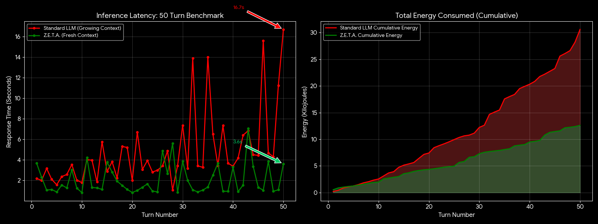

# Z.E.T.A. Zero

> **Zero Entropy Temporal Assimilation (v0)**

[-blue)](LICENSE)
[](https://isocpp.org/)
[](https://github.com/ggerganov/llama.cpp)

---

## Quickstart

```bash
git clone https://github.com/H-XX-D/ZetaZero.git
cd ZetaZero
./quickstart.sh
```

Or with Docker directly:

```bash
docker run -d -p 8080:8080 \
  -v ~/models:/models \
  -v ~/.zetazero:/storage \
  ghcr.io/h-xx-d/zetazero:latest
```

Want to tweak settings later? Run `./quickstart.sh --unlock` to disable password protection on config changes.

---

## A Fundamental Shift in Cognitive Architecture

Z.E.T.A. Zero inverts the current dogma that **More Parameters = More Intelligence**.

Current LLMs are structurally stateless. They spend massive amounts of energy computing a "thought," only to discard that thought into entropy the moment the token is generated. They recompute the entire world model for every single exchange.

Z.E.T.A. asks three simple questions:

1. **Why waste the compute?** If a thought is computed once, it should be persisted, not discarded.

2. **Why limit context to VRAM?** Memory should be an explicit graph, not an implicit buffer.

3. **Why force generation?** If the model doesn't have an answer, should it output nonsense? Or should it have the agency to stop and correct itself?

4. **What would an AI dream up while you're dreaming too?**

**Z.E.T.A. is not a model. It is a Framework for Cognitive Constructs.**

---

## The Problem

### 50-Turn Conversation Benchmark



**Real 50-turn conversation** with facts, retrieval questions, and general knowledge mixed together.  
**Turn 50:** Standard LLM takes **16.7s** and **2,395 Ws**. Z.E.T.A. takes **3.6s** and **216 Ws**.  
That's **4.6x faster** and **11x less energy**.

### Environmental Impact at Scale

| Scale | Energy Saved | CO₂ Avoided | Equivalent |
|-------|-------------|-------------|------------|
| 1M conversations/day | 1,944 kWh/day | 284 tons CO₂/year | 62 cars off the road |
| 10M conversations/day | 19,440 kWh/day | 2,840 tons CO₂/year | 620 cars off the road |
| 100M conversations/day | 194,400 kWh/day | 28,400 tons CO₂/year | **6,000 cars off the road** |

*Based on US grid average of 0.4 kg CO₂/kWh. Savings calculated from 7,000 Ws per 50-turn conversation.*

<details>
<summary><strong>Benchmark Methodology</strong></summary>

**Hardware:**
- GPU: NVIDIA RTX 5060 Ti 16GB
- System: Jetson-class edge server
- Idle power: ~20W

**Test Setup:**
- Model: Qwen2.5 14B (Q4_K_M quantization)
- 50-turn realistic conversation with mixed content
- 35 fact statements, 12 retrieval questions, 3 general knowledge
- Max tokens: 100, Temperature: 0
- 2-second pause between queries

**Growing Context (Standard LLM):**
Each turn accumulates full conversation history. Turn N sends N prior exchanges + new question. Context grows linearly, reprocessed every turn.

**Fresh Query (Z.E.T.A.):**
Each query sent independently. Prior context stored in graph, retrieved via embedding similarity—not reprocessed as raw tokens.

**Measurements:**
- Time: `date +%s.%N` before/after curl request
- Power: `nvidia-smi --query-gpu=power.draw` after response
- Energy: Peak power × response time (Watt-seconds)

**Raw data:** [benchmarks/50_turn_realworld.json](benchmarks/50_turn_realworld.json)

</details>

---

## Architecture

Three models, one cognitive loop:

| Role | Why |
|------|-----|
| **Reasoning (14B)** | Complex planning, analysis, multi-step thought |
| **Coding (7B)** | Fast code generation, syntax, execution |
| **Memory (Embed)** | Semantic search, graph retrieval, similarity |

The 14B thinks. The 7B executes. The embedder remembers.

They share a persistent knowledge graph—not a context window. When one model learns something, the others can retrieve it. When the 14B reasons through a problem, that reasoning is stored, not discarded.

---

## Dream State

When Z.E.T.A. has no active queries, it doesn't just sit there. It dreams.

1. **Memory Consolidation** — Prunes weak connections, strengthens frequently-accessed paths
2. **Temperature Cranked** — Sampling goes high. Creative mode, not precise-answer mode
3. **Codebase Wandering** — Walks your indexed files making unexpected connections
4. **Outputs to `dreams/`** — `code_fix`, `code_idea`, `insight`

Nobody asked for this. The model dreamed it:

> **"Code Symphony"** — Map internal operations to sound. Arithmetic → rhythmic beats. Conditionals → melodies. Let users *hear* their code execute. An interactive auditory interface where you trigger functions and hear how they affect the generated soundscape...

That emerged from high-temperature free-association across a codebase—connecting audio processing patterns to execution flow to UI feedback—because that's what happens when you let a model wander with the reins loose.

Some dreams are noise. Some are "why didn't I see that?"

---

## The Silicon Accord

How do you control something that has the potential to become uncontrollable before you can react?

You make its ethics hardcoded to its cognition. Not a system prompt that can be jailbroken. Not a filter that can be bypassed. The constitution is cryptographically bound to the weights themselves:

```c
typedef struct {
    uint8_t hash[32];           // SHA-256 of constitution text
    uint64_t seed;              // PRNG seed derived from hash
    bool verified;              // True only if constitution matches
} zeta_constitution_t;

// 1. Hash the constitution → 256-bit key
// 2. Key seeds the PRNG for weight permutation
// 3. Weights are STORED permuted — wrong key = garbage output

void zeta_generate_permutation(
    const zeta_constitution_t* ctx,  // Contains the hash
    int* permutation_out,            // Shuffle order for weights
    int n
);
```

The model cannot function without the correct constitution present. Change the ethics, the weights become noise. It governs itself or lobotomy 

→ [zeta-constitution.h](llama.cpp/tools/zeta-zero/zeta-constitution.h)  
→ [THE_SILICON_ACCORD.txt](THE_SILICON_ACCORD.txt)

---

## License

Dual licensed: [Open Source](LICENSE) + [Commercial](COMMERCIAL_LICENSE.md)

If your company uses Z.E.T.A. and earns over $2 million/year in revenue, contact for pricing.

Otherwise? Use it to go make $2 million a year.

**todd@hendrixxdesign.com**
