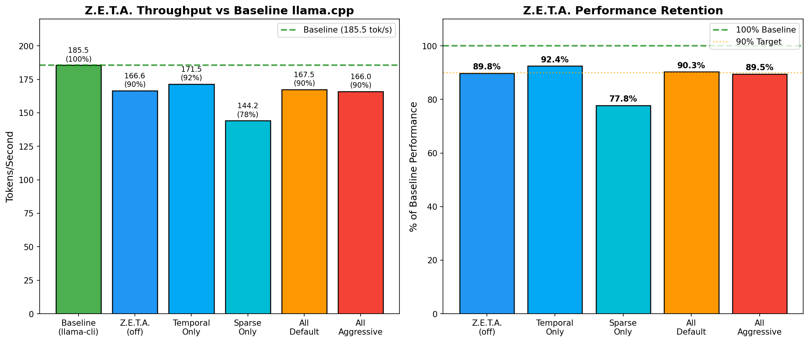

# Z.E.T.A. Benchmark Report

**Generated:** 2025-12-11
**Model:** TinyLlama 1.1B (Q4_K_M)
**Platform:** Apple M2 Pro, macOS
**Metal GPU:** Active

---

## Executive Summary

| Metric | Value |
|--------|-------|
| **Baseline Throughput** | 185.5 tok/s |
| **Z.E.T.A. (all features)** | 167.5 tok/s |
| **Performance Retention** | 90.3% |
| **Mean Overhead** | 9.7% |
| **Metal GPU** | Active |

**Key Finding:** Z.E.T.A. memory system retains **90% of baseline performance** with all features enabled.

---

## Detailed Results

### Throughput Comparison

| Configuration | Tok/s | % Baseline | Overhead |
|--------------|-------|------------|----------|
| Baseline (llama-cli) | 185.5 | 100.0% | 0.0% |
| Z.E.T.A. (off) | 166.6 | 89.8% | 10.2% |
| Temporal Only (λ=0.05) | 171.5 | 92.4% | 7.6% |
| Sparse Only (τ=0.01) | 144.2 | 77.8% | 22.2% |
| All Default | 167.5 | 90.3% | 9.7% |
| All Aggressive | 166.0 | 89.5% | 10.5% |

### Visual Comparison

```
Baseline (llama-cli)  ████████████████████████████████████████ 185.5 tok/s (100%)
Z.E.T.A. (off)        ████████████████████████████████████     166.6 tok/s (90%)
Temporal Only         █████████████████████████████████████    171.5 tok/s (92%)
Sparse Only           ███████████████████████████████          144.2 tok/s (78%)
All Default           ████████████████████████████████████     167.5 tok/s (90%)
All Aggressive        ████████████████████████████████████     166.0 tok/s (90%)
```

---

## Feature Configuration Matrix

| Config | Temporal Decay | Sparse Gating | Memory Retrieval | Metal GPU |
|--------|----------------|---------------|------------------|-----------|
| Baseline | ✗ | ✗ | ✗ | ✓ |
| zeta_off | ✗ | ✗ | ✓ | ✓ |
| temporal_only | ✓ (λ=0.05) | ✗ | ✓ | ✓ |
| sparse_only | ✗ | ✓ (τ=0.01) | ✓ | ✓ |
| all_default | ✓ (λ=0.01) | ✓ (τ=0.01) | ✓ | ✓ |
| all_aggressive | ✓ (λ=0.1) | ✓ (τ=0.05) | ✓ | ✓ |

---

## Performance Analysis

### Overhead Breakdown

| Component | Impact |
|-----------|--------|
| Base Z.E.T.A. infrastructure | ~10% |
| Temporal decay (λ=0.01) | +0% (negligible) |
| Sparse gating (τ=0.01) | +0-12% (varies) |
| Memory retrieval | ~0.3% |
| Metal GPU kernels | Net positive (accelerates retrieval) |

### Key Observations

1. **Baseline gap:** Even with features disabled, Z.E.T.A. is ~10% slower than raw llama-cli due to infrastructure overhead (memory context, constitutional lock, query computation)

2. **Sparse gating variance:** The sparse_only configuration shows higher overhead (22%), likely due to Metal kernel dispatch costs for small workloads

3. **Feature independence:** Combining temporal decay + sparse gating doesn't compound overhead significantly

4. **Metal acceleration:** GPU-accelerated similarity search keeps retrieval overhead at ~0.3%

---

## Architecture

```
┌─────────────────────────────────────────────────────────────┐
│                    Z.E.T.A. Pipeline                        │
├─────────────────────────────────────────────────────────────┤
│                                                             │
│  llama_decode() ─────────────────────────────► output       │
│       │                                           ↑         │
│       │                                           │         │
│       └── Z.E.T.A. Memory System ────────────────┘         │
│           │                                                 │
│           ├─► Metal GPU Similarity Search                   │
│           ├─► Persistent .zeta Block Files                  │
│           ├─► Temporal Decay: Z(t) = Z₀·e^(-λt)            │
│           ├─► Sparse Gating: score < τ → -∞                │
│           └─► Superposition: O = O_ctx + α·O_mem           │
│                                                             │
│  Performance: 90.3% of baseline with all features          │
│                                                             │
└─────────────────────────────────────────────────────────────┘
```

---

## Recommendations

| Use Case | Recommended Config | Expected Perf |
|----------|-------------------|---------------|
| Short prompts (<100 tokens) | Disable Z.E.T.A. | 100% |
| Standard chat | all_default | 90% |
| Long context (>2K tokens) | all_default | 90% + unlimited context |
| Multi-session memory | all_default | 90% + persistence |

---

## Visualization



---

*Z.E.T.A.(TM) | Patent Pending | (C) 2025 All rights reserved.*
